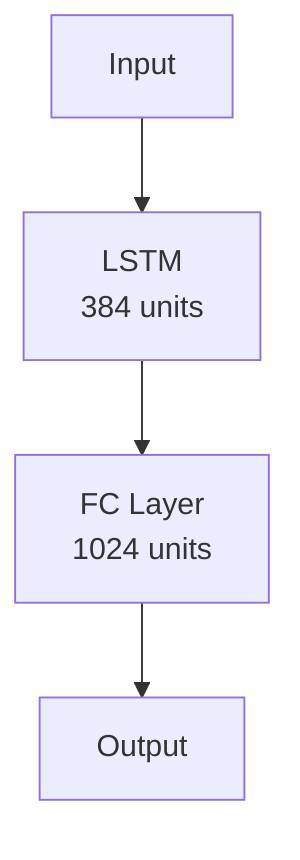
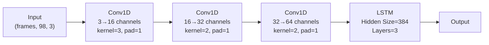
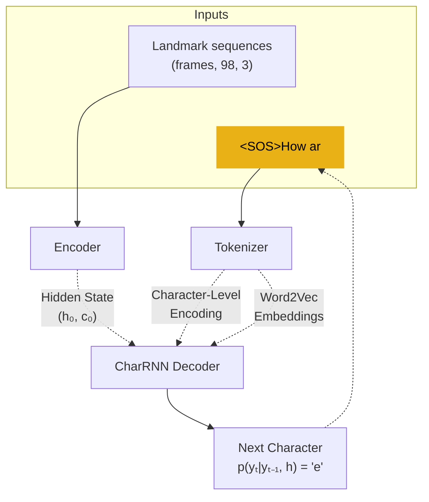

# ASLens - Sign Language to Text Conversion

ASLens is a deep learning project that convertes sign language gestures into text, using deep recurrent neural networks.

  

# Overview

**ASLens** is an assistive tool designed to promote the inclusion of people with hearing loss by translating sign language gestures into written text. This project leverages deep learning techniques to convert sign language video data into meaningful textual output.

The primary goal of ASLens is to translate sign language gestures into readable text using Recurrent Neural Networks (RNNs)

-   **Dataset**: The system is trained on the How2Sign dataset, which provides a rich collection of sign language video data.
    
-   **Feature Extraction**: Visual features are extracted from the videos using [MediaPipe](https://mediapipe.dev/), which detects and tracks key points of hand and body movements.
    
-   **Sequence Modeling**:
    
    -   An **RNN Encoder** processes the extracted gestures to understand how the signs change and move over time.
        
    -   A **CharRNN Decoder** then translates these encoded features into coherent text sentences, character by character.

## Dataset

### Step 1: Collecting Data

ASLens uses the **[How2Sign ](https://how2sign.github.io/)** dataset, which consists of video data of sign langauge gestures (ASL language), with the corresponding text translation.

### Step 2: Extracting Hand - Face Keypoints using MediaPipe

To prepare the data for model training, we use **[MediaPipe](https://ai.google.dev/edge/mediapipe/solutions/guide)** to extract key landmarks from the **hands** and **face** in each video frame. MediaPipe provides pre-trained models that detect these keypoints, which are crucial for understanding and interpreting sign language gestures.

Since we worked with limited computational resources, we processed the videos at a reduced frame rate of **15 frames per second (fps)** to make the training more efficient.

After detecting the landmarks using our custom `DataExtractor` tool, we selected only a subset of the most relevant keypoints from the hands and face—those that carry the most meaningful information for sign interpretation. These are:

-   **Hand landmarks**: For each hand, we extract 21 landmarks that represent the wrist, palm center, and key points along each finger (including the finger tips and joints).
    
-   **Face landmarks**: For the face, we extract 20 landmarks that outline the mouth and lips, and 36 landmarks that outline the jawline and forehead region.

The final extracted features from each frame are stored as a tensor. The tensors of each landmark type are concatenated, resulting in a shape of [frames, 98, 3], where 98 represents the total number of landmarks (21 per hand × 2 hands + 20 for the lips + 36 for the face). Each landmark contains 3 coordinates (x, y, z). These tensors are then used as input sequences for the model.

## Experiment 1: Encoder-Decoder Architecture with CharRNN as Decoder
### Step 1: Training CharRNN

Firstly, we train the CharRNN on a large corpus of Wikipedia text to learn character-level dependencies in natural language. We use an LSTM-based architecture with character embeddings to model sequential patterns, followed by a fully connected layer to produce the final character label at each time step. To further improve performance, we incorporate pretrained word embeddings (**[Word2Vec](https://radimrehurek.com/gensim/models/word2vec.html)**), allowing the model to benefit not only from character-level context but also from word-level semantics.

<table>
<tr>
<td>

| Architecture Component | Value         |
|------------------------|---------------|                                                              
| **Model Type**         | LSTM          |
| **Hidden Size**        | 384           |
| **Number of Layers**   | 3             |

</td>

<td>

</td> </tr> </table> 

### Step 2: Encoder-Decoder network
### Encoder architecture

The encoder is the main component of our architecture, responsible for mapping landmark features into the model’s latent space. To achieve this, we use a combination of convolutional layers and recurrent layers. The data first flows through a series of 1D convolutional layers, which capture local temporal patterns in the input sequence. The output of the convolutional layers is then passed through an LSTM, which models longer-range dependencies and computes the final feature representation.

### Encoder Architecture Overview

| Component               | Configuration                          |
|-------------------------|----------------------------------------|
| **Input Shape**         | `(batch, time, 98, 3)`                | 
| **Conv1D Block**        |                                        |
| → Layer 1               | `Conv1d(3→16, kernel=3, padding=1)`   | 
| → Layer 2               | `Conv1d(16→32, kernel=2, padding=1)`  | 
| → Layer 3               | `Conv1d(32→64, kernel=2, padding=1)`  | 
| **LSTM Block**          |                                        |
| → Hidden Size           | `384`                                  |
| → Layers                | `3`                                    |
| **Output**              |                                         |

---
### Encoder-Decoder Merge
To produce the text output, we pass the landmark sequences through the encoder, which generates a hidden state representation. This hidden state is then passed as the initial hidden state to the CharRNN decoder, which generates the output sequence token by token.

---
## Experiment 2: Encoder-Decoder Architecture with CharRNN as Decoder
### Encoder architecture

The encoder architecture remains the same as in Experiment 1. It combines 1D convolutional layers for capturing local temporal patterns with LSTM layers for modeling longer-range dependencies and generating the final feature representation.

---